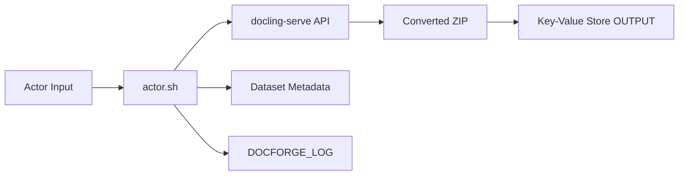

# 文档炼金炉云端封装 DocForge Actor

🔥 基于 `docling-serve` 的服务化文档转换封装。  
🚀 支持 URL 批量输入、统一转换、结果打包回传。  
⭐ 适合 Apify/容器任务编排、异步文档处理与下游流水线接入。

<p align="center">
  
  
  
  
</p>

---

## 目录

- [1. 项目说明](#1-项目说明)
- [2. 功能特性](#2-功能特性)
- [3. 快速使用](#3-快速使用)
- [4. 输入参数](#4-输入参数)
- [5. 输出结果](#5-输出结果)
- [6. 环境变量配置](#6-环境变量配置)
- [7. 本地开发](#7-本地开发)
- [8. 执行架构](#8-执行架构)
- [9. 错误码表](#9-错误码表)
- [10. Output Manifest 规范](#10-output-manifest-规范)
- [11. 故障排查](#11-故障排查)
- [12. 安全说明](#12-安全说明)
- [13. 许可](#13-许可)

---

## 1. 项目说明

`DocForge Actor` 是 `DocForge` 主项目的云端执行封装层。

它的目标是将“文档转换能力”以任务化方式暴露出来，便于外部系统按批次触发、收集产物，并串联后续处理流程（如入库、索引、RAG 切片、审计归档）。

---

## 2. 功能特性

- 基于官方 `docling-serve-cpu` 镜像运行
- 支持 PDF、Office、图片等多类型文档
- 支持 OCR 场景（扫描件、低质量文档）
- 支持多输出格式（`md/json/html/text/doctags`）
- 统一输出 ZIP 结果，便于传输与归档
- 自动写入任务元数据到 dataset
- 支持日志回传到 key-value store（默认键：`DOCFORGE_LOG`）

---

## 3. 快速使用

### 3.1 控制台运行

1. 打开 Actor 页面。
2. 点击 `Run`。
3. 填入 `http_sources` 与 `options`。
4. 等待任务完成，获取 `OUTPUT` 产物链接。

### 3.2 API 触发示例

```bash
curl --request POST \
  --url "https://api.apify.com/v2/acts/<your-account>~docforge-actor/run" \
  --header 'Content-Type: application/json' \
  --header 'Authorization: Bearer YOUR_API_TOKEN' \
  --data '{
    "options": {
      "to_formats": ["md", "json", "html", "text", "doctags"]
    },
    "http_sources": [
      {"url": "https://arxiv.org/pdf/2408.09869"}
    ]
  }'
```

### 3.3 CLI 触发示例

```bash
apify call <your-account>/docforge-actor --input='{
  "options": {
    "to_formats": ["md", "json", "html", "text", "doctags"]
  },
  "http_sources": [
    {"url": "https://arxiv.org/pdf/2408.09869"}
  ]
}'
```

---

## 4. 输入参数

输入结构定义在 `.actor/input_schema.json`。

| 字段 | 类型 | 必填 | 说明 |
|---|---|---|---|
| `http_sources` | array | 是 | 待处理文档 URL 列表 |
| `options` | object | 是 | docling-serve 转换参数 |

示例：

```json
{
  "options": {
    "to_formats": ["md", "json"]
  },
  "http_sources": [
    {"url": "https://arxiv.org/pdf/2408.09869"}
  ]
}
```

---

## 5. 输出结果

任务完成后提供四类结果：

1. `OUTPUT`：转换结果 ZIP 文件
2. `OUTPUT_MANIFEST`：标准化运行清单（可通过环境变量改键名）
3. dataset 记录：包含 `status`、`error_code`、`manifest_file` 等
4. `DOCFORGE_LOG`：处理日志与错误上下文

常见访问方式：

```bash
apify key-value-stores get-value OUTPUT
apify key-value-stores get-value OUTPUT_MANIFEST
apify key-value-stores get-record DOCFORGE_LOG
```

---

## 6. 环境变量配置

关键变量如下：

- `DOCLING_SERVE_API_ENDPOINT`
- `DOCLING_ACTOR_LOG_KEY`
- `DOCLING_ACTOR_MANIFEST_KEY`
- `APIFY_DEFAULT_KEY_VALUE_STORE_ID`

推荐配置示例：

```bash
export DOCLING_SERVE_API_ENDPOINT="http://127.0.0.1:5001/v1alpha/convert/source"
export DOCLING_ACTOR_LOG_KEY="DOCFORGE_LOG"
export DOCLING_ACTOR_MANIFEST_KEY="OUTPUT_MANIFEST"
```

说明：未配置时，脚本使用默认值，保持兼容行为。

---

## 7. 本地开发

```bash
# 1) 在仓库根目录构建镜像
docker build -f .actor/Dockerfile -t docforge-actor:local .

# 2) 运行任务（示例）
docker run --rm -it docforge-actor:local
```

目录结构：

```text
.actor/
├── Dockerfile
├── actor.json
├── actor.sh
├── input_schema.json
├── dataset_schema.json
├── output_manifest.schema.json
├── ERROR_CODES.md
├── OUTPUT_MANIFEST_SPEC.md
└── README.md
```

---

## 8. 执行架构



执行流程摘要：

1. 读取 Actor 输入
2. 启动本地 `docling-serve`
3. 将输入转换为请求 JSON
4. 调用 `/v1alpha/convert/source`
5. 上传转换产物到 `OUTPUT`
6. 写入 dataset 结果与日志

---

## 9. 错误码表

错误码详见：

- [ERROR_CODES.md](ERROR_CODES.md)

常见代码：

- `A0000`：成功
- `A1001`：`docling-serve` 启动失败
- `A3001`：未找到转换输出 zip
- `A3002`：输出 zip 上传失败
- `A3003`：manifest 上传失败

---

## 10. Output Manifest 规范

规范详见：

- [OUTPUT_MANIFEST_SPEC.md](OUTPUT_MANIFEST_SPEC.md)
- [output_manifest.schema.json](output_manifest.schema.json)

默认情况下，Actor 会把 manifest 作为 `OUTPUT_MANIFEST` 写入 key-value store。

---

## 11. 故障排查

### 11.1 无法访问文档 URL

- 确认 URL 可公开访问
- 确认 URL 直接指向文件而非重定向页面

### 11.2 OCR 结果异常

- 检查源文档清晰度
- 检查文件是否加密或损坏
- 尝试关闭 OCR 后复测

### 11.3 无输出文件

- 查看 `DOCFORGE_LOG`
- 检查 `DOCLING_SERVE_API_ENDPOINT` 是否可达
- 检查请求 JSON 结构是否满足 schema

---

## 12. 安全说明

- 以非 root 用户运行容器
- 输入 URL 在处理前进行校验
- 临时文件在任务结束后清理
- 日志用于审计与故障定位，建议结合平台权限控制

---

## 13. 许可

- 本目录封装代码：遵循仓库 MIT License
- 上游内核能力：遵循 `docling` 与相关依赖许可证
